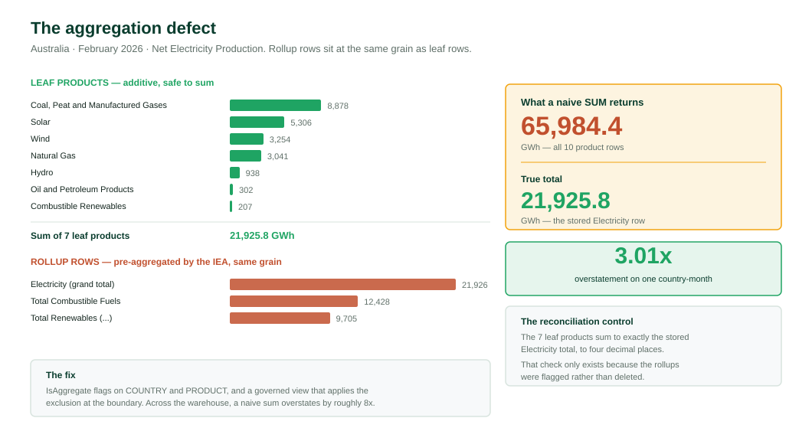
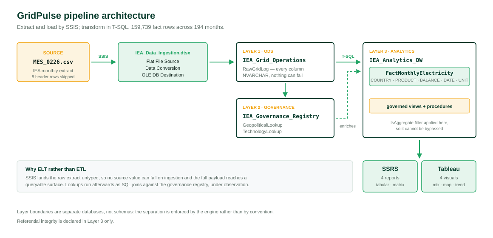
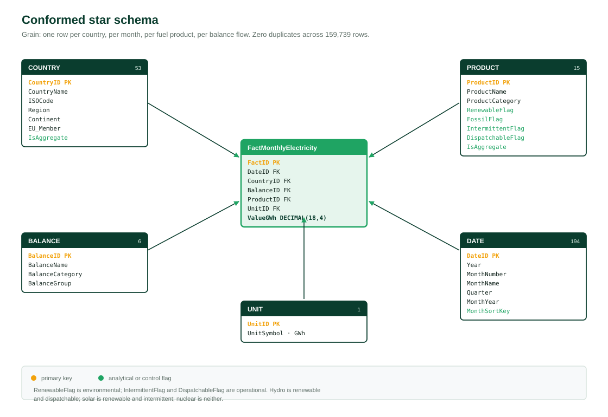

# GridPulse — Energy Intelligence Data Warehouse

A governed dimensional data warehouse over the International Energy Agency's monthly electricity statistics, with a full reporting and analytics tier.

**159,739 fact rows · 194 months · 48 countries · 12 fuel types · 6 balance flows**

Built in SQL Server with SSIS, surfaced through SSRS and Tableau.

---

## The problem this solves

The IEA publishes an authoritative statistical product, not an analytical one. Four properties make the raw extract unsafe to query directly.

**Rollup rows sit at leaf grain.** Regional aggregates such as `OECD Total` occupy the same structural level as individual countries, and product totals such as `Electricity` sit alongside the individual fuels that compose them. Anyone who opens the extract and applies a `SUM` gets a wrong answer with no warning.

**Coverage is ragged.** Countries entered the monthly series at different dates. Summing across countries over time produces discontinuities that look like growth but are artefacts of panel composition.

**Encoding is inconsistent.** Absent values arrive as the literal four-character string `NULL`. September appears in two abbreviation forms depending on extract vintage. Neither breaks a load. Both break a report.

**There are no conformed semantics.** The source has no concept of renewable, intermittent or dispatchable. Every analyst invents their own classification and no two reconcile.

---

## The finding worth reading

The aggregation defect is measurable. For Australia in February 2026 under the Net Electricity Production balance:

| Method | Result | |
|---|---|---|
| Naive `SUM` across all product rows | 65,984.4 GWh | includes rollups |
| Stored total (the `Electricity` member) | 21,925.8 GWh | correct |
| **Overstatement** | **3.01x** | structural, not random |

Across the full warehouse an unfiltered sum overstates by roughly eightfold.

The fix is structural rather than procedural. Rather than relying on analysts remembering to exclude rollups, the warehouse carries an `IsAggregate` flag on the `COUNTRY` and `PRODUCT` dimensions, and every downstream report reads through a governed view that applies the exclusion at the boundary. The correct query became the easy query.

The rollup rows were **flagged rather than deleted**, deliberately. The stored IEA totals then serve as an independent reconciliation control: the sum of leaf members can be checked against the supplied total, and any variance surfaces a data quality problem that deletion would have concealed.

---

## The audit that changed the diagnosis

After the initial load, the SSRS reports failed: partial rendering, missing column headers, blank cell blocks. The SSIS packages had been run with the `Ignore Failure` error disposition during development, so the working assumption was that rows had been dropped silently.

Before remediating anything, all 159,739 rows were audited.

| Test | Result |
|---|---|
| Orphaned surrogate keys | 0 |
| Measure coercion or truncation | 0 |
| Grain duplicates | 0 |
| Dimensional attribute conflicts | 0 across 53, 15 and 6 members |
| Dates unparseable against declared format | 0 |

The dimensional consistency test is the strongest of the five. If rows had been silently mangled, the same `ProductName` would carry two different `ProductCategory` values somewhere in the set. It does not, anywhere.

`Ignore Failure` had not corrupted the data. The actual causes were textual, and none of them stopped a load:

- **September stored two ways.** 13,174 rows carried `Sept-19` against 146,565 using `Sep-19`. An SSRS matrix grouped on that field creates two separate column groups, which is the missing header.
- **Literal `NULL` as text.** 19,202 rows stored the word as four characters, so every `IsNothing` check in the reports was dead code.
- **Text sorting on dates.** `MonthYear` is a string, so it sorted `Apr-10, Apr-11, Apr-12, Aug-10` rather than chronologically.

The fix for all three went into the database, not the reports.

---

## Architecture

Three physical databases rather than three schemas, so the boundary is enforced rather than conventional.

    ┌─────────────────────────┐
    │  IEA_Grid_Operations    │   Operational data store.
    │  RawGridLog             │   Every column NVARCHAR, so no
    │                         │   source value can fail on ingest.
    └───────────┬─────────────┘
                │  SSIS: derived column, lookups, error routing
    ┌───────────▼─────────────┐
    │ IEA_Governance_Registry │   Lookup registries and the
    │                         │   error-capture table.
    └───────────┬─────────────┘
                │
    ┌───────────▼─────────────┐
    │   IEA_Analytics_DW      │   Star schema, governed views,
    │   FactMonthlyElectricity│   stored procedures. Referential
    │   + 5 dimensions        │   integrity enforced here only.
    └───────────┬─────────────┘
                │
        ┌───────┴────────┐
        │                │
    ┌───▼────┐      ┌────▼─────┐
    │  SSRS  │      │ Tableau  │
    │ 4 rpts │      │ 4 visuals│
    └────────┘      └──────────┘

Landing everything as text is what made the post-hoc audit possible: the complete source payload reached a queryable surface before any conversion was attempted.

Full detail in [docs/ARCHITECTURE.md](docs/ARCHITECTURE.md).

---

## The dimensional model

One fact table, five conformed dimensions.

**Declared grain:** one row per country, per calendar month, per fuel product, per balance flow. Tested across all 159,739 rows and returned zero duplicate violations.

The `PRODUCT` dimension carries `RenewableFlag` independently of `IntermittentFlag` and `DispatchableFlag`. The renewable classification is environmental; intermittency and dispatchability are operational. Hydro is renewable and dispatchable, solar is renewable and intermittent, nuclear is neither renewable nor intermittent. Collapsing these into one attribute would lose the distinction that matters most to a grid operator.

---

## BI tier

Every report and every visual reads through `vw_ElectricityFacts_Leaf` or `vw_ElectricityTotals`. Nothing queries the fact table directly, so the aggregate exclusion cannot be bypassed by accident.

**SSRS — four operational reports**

| Report | Purpose |
|---|---|
| Tabular | Printable national production record, one row per country, month and fuel |
| Matrix | Fuel type against calendar year, with category subtotals |
| Parameterised | Country profile driven by stored procedures, multi-value country selection |
| Drill-down | Continent → region → country → fuel category, totalling at every level |

**Tableau — four executive visuals**

| Visual | Shows |
|---|---|
| Energy mix donut | Generation composition with a renewable share KPI |
| Import dependency map | Net cross-border exposure with stepped threshold bands |
| Transition trend | Sixteen-year monthly series with a seasonal forecast |
| Distribution loss ranking | Network loss rate against the OECD mean |

---

## Selected findings

| Metric | Value |
|---|---|
| Generation mix | 57.8% fossil · 29.5% renewable · 12.5% nuclear |
| Renewable share, 2010 → 2025 | 18.8% → 37.8%, with the annual gain steepening after 2022 |
| Network loss spread | 16.6% (Lithuania) against 4.7% (Slovakia), OECD mean 5.9% |
| Trade coverage | 37 of 48 countries report cross-border flow; 11 are islanded and report none |

The eleven non-trading countries are rendered as a discrete category rather than as zero per cent. Zero would mean a country that trades and nets to nil, which is a different and genuine finding.

---

## Repository contents

    scripts/
      01_create_star_schema.sql        Database and star schema deployment
      02_aggregate_flags.sql           IsAggregate metadata and classification
      03_remediation_and_integrity.sql Date fixes, NULL conversion, constraints
      04_views.sql                     The two governed views
      05_stored_procedures.sql         Parameterised report procedures
      06_audit_queries.sql             The integrity audit, reproducible
    docs/
      ARCHITECTURE.md                  Layer design, grain, dimension detail
      DESIGN_DECISIONS.md              Trade-offs and what I would change
      images/                          Diagrams and screenshots
    archive/
      init_database_medallion.sql      The original medallion-architecture script

---

## What is in this repository, and what is not

The scripts here are the **database layer**, executed in SQL Server Management
Studio. They create the three databases and the star schema, apply the aggregate
isolation metadata, remediate the source defects, enforce referential integrity,
and build the governed views and reporting procedures.

They do **not** load data. The extract, transform and load was performed by SSIS
packages: a control flow ordering dimension loads before the fact load, and a data
flow chaining a flat file source, a derived column transformation for trimming and
literal-token normalisation, five lookups resolving natural keys to surrogate keys,
error output routing for no-match rows, and a bulk-load destination. That pipeline
is described in [docs/ARCHITECTURE.md](docs/ARCHITECTURE.md) and shown in the
screenshots under `docs/images/`.

The `.dtsx` packages themselves are not committed, because they embed environment
specific connection managers and file paths that would not resolve outside the
machine they were built on.

So the sequence to reproduce the warehouse is:

1. Run `scripts/01` to create the databases and schema
2. Load the dimensions and fact table through SSIS
3. Run `scripts/02` and `scripts/03` to apply metadata, remediation and constraints
4. Run `scripts/04` and `scripts/05` to build the access layer
5. Run `scripts/06` at any point to reproduce the integrity audit

## Running the scripts

Requires SQL Server 2016 or later (the stored procedures use `STRING_SPLIT`) and SQL Server Management Studio.

Execute them in numerical order, observing the sequence above. Script 01 creates the databases and will drop `IEA_Analytics_DW` if it already exists, so read the header before running it.

Script 06 is read-only and can be run at any time.

---

## Design decisions

A summary of the trade-offs, including why this started as a medallion architecture and became a three-layer SSIS pipeline, is in [docs/DESIGN_DECISIONS.md](docs/DESIGN_DECISIONS.md).

---

## Why this architecture transfers

The pipeline here is a high-volume time-series ingestion problem with a
correctness requirement: parse a messy source, normalise it into a conformed
schema, enforce integrity at the boundary, and make the correct query the easy
one. That shape is the same whether the telemetry is national electricity
generation or industrial control system sensor readings.

Two parts carry over directly to security monitoring. The governed view layer is
the same pattern as a normalised detection schema, where the analyst must not be
able to query the raw source by accident. The integrity audit in
`scripts/06_audit_queries.sql` is the same discipline as validating a detection
before it ships: the reports were failing, the assumed cause was row loss, and
auditing all 159,739 rows before remediating showed the assumption was wrong. The
actual defect was two characters in a month abbreviation.

Verifying before diagnosing is the transferable part.

---

## Acknowledgement

Built as part of an MSc group project at Dublin Business School. Everything documented in this repository is my own work: the source selection and schema design, the three-layer database build, the SSIS pipeline, the governance layer, the integrity audit, and the SSRS and Tableau reporting tier.

A separate comparative database component of the wider assignment was completed by another group member and is deliberately not included here.

Data source: International Energy Agency, Monthly Electricity Statistics.

## Licence

MIT

# energy-intelligence-data-warehouse
Developing a modern data warehouse to obtain energy intelligence from data.
